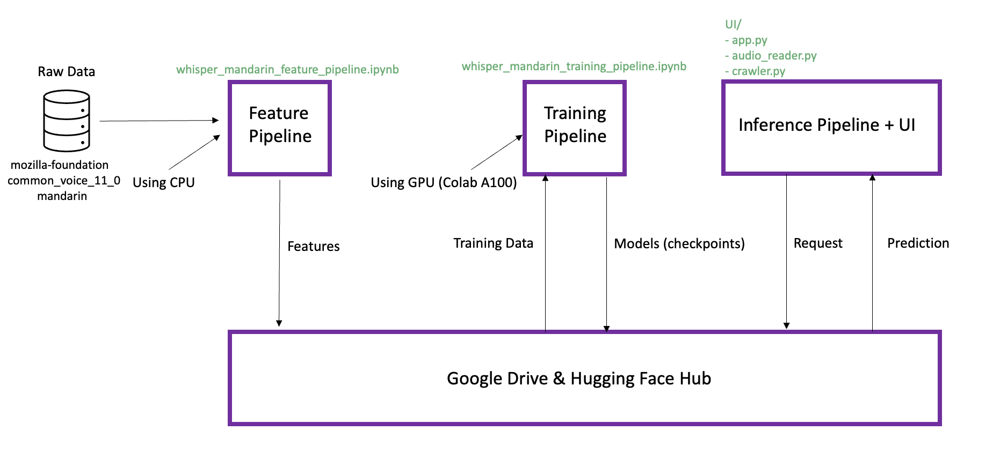

# ID2223 Lab2

## Description
This lab is about Text Transcription using Transformers to your Mother Tongue. The overall framework of this lab is shown as follows.  

### Framework
The file framework of this repo:
```markdown
UI/
|app.py ------------------------------------------------- Gradio UI file
|requirements.txt --------------------------------------- Requirement file we need in UI
|crawler.py --------------------------------------------- Web Crawler
|audio_reader.py ---------------------------------------- Audio Reader
old_tools/ ---------------------------------------------- Old version
README.md  ---------------------------------------------- Readme file
whisper_mandarin_feature_pipeline.ipynb ----------------- Feature pipeline of whisper_mandarin
whisper_mandarin_training_pipeline.ipynb ---------------- Training pipeline of whisper_mandarin
```

In this lab, we first fine-tune a pretrained  transformer model [Whisper provided by openai](https://openai.com/research/whisper) for mandarin.
The Word Error Rate (WER) we get after multiple training sessions is 109.
Then, we build and run an inference pipeline with a [Gradio UI on Hugging Face Spaces](https://huggingface.co/spaces/Dengty/Mandarin) for our model. 
In this Gradio UI, we realize the following functions.
1. Speak to Search.User can speak into the microphone about the video they want to search on YouTube.
2. Crawl Video. Then, the web crawler implemented by us will return a list of URLs of the related videos on YouTube.
3. Transcription. We can choose one URL and then the audio of this video will be transcribed into text.

### Model Improvement
We think in the following two approaches.
First approach is model-centric approach, which is about tuning hyperparamters, changing the fine-tuning model architecture.
Second approach is data-centric approach, which is about identifying new data sources enabling to train a better model.
#### Model-Centric Approach
1. Tuning hyperparameters. 
   - ```Learning_rate```. The learning rate is a hyperparameter that controls the size of the step taken during optimization in the training of a machine learning model. 
   It is a critical hyperparameter because it influences the convergence and stability of the training process. We did a lot of research about what is a good
   learning rate for fine-tune a small whisper model, according to this [link](https://github.com/vasistalodagala/whisper-finetune?tab=readme-ov-file#hyperparameter-tuning),
   we tweak the ```Learning_rate``` from 1e-5 to 1.25e-5.
   - ```num_train_epochs```. This hyperparameter decides the total number of training epochs to perform. 
   The defaults is 3.0 and we tweak it to 5.0 so that the model will learn in a longer time.
2. Changing the fine-tuning model architecture.
   - Change the model size. In this lab, we use the small size whisper that is pretrained by openai. The parameter number of small size is 244M while for the large size is 1550M.
   So if we change our model size from small to large, then we will have a model with the ability to accomplish more complicated transcription task. 
   However, due to the long time we need to train the model, we didn't change the model size in practice.

####  Data-Centric Approach
Besides Common Voice dataset we used in this lab, we found out some useful dataset for mandarin transcription. Here are the links:
- [AISHELL-1 Dataset](https://www.openslr.org/33/) 
- [WenetSpeech Dataset](https://paperswithcode.com/dataset/wenetspeech) 

However, due to the time restriction, we didn't use these two datasets in practice. 

## Contributor
This repo is contributed by [Tianyu Deng](https://github.com/dengty1998) and [Wenjian Ma](https://github.com/wenjianma)